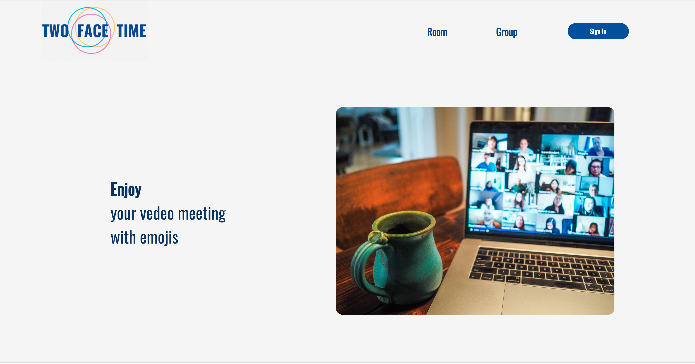
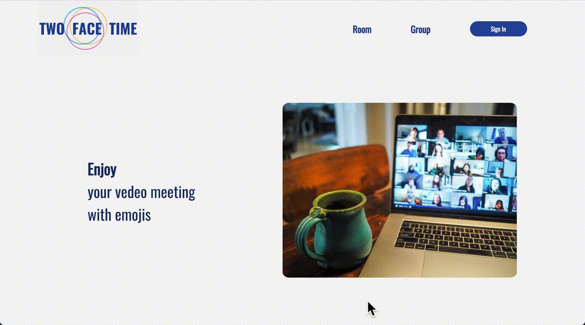

## 😃 Introduction

Two Face Time은 얼굴을 인식하고 표정을 분석해 그에 맞는 이모티콘을 얼굴 위에 띄워주는 '실시간 화상 채팅 웹 애플리케이션'입니다. 프로젝트의 이름은 '나의 얼굴과 이모티콘, 2개의 얼굴로 화상 채팅을 한다'는 의미를 담고 있습니다.

---

## 🔍 Contents

- Introduction
- Installation
- Features
- Tech
- Collaboration Tools for Team project
- Motivation
- Duration and Process
- Challenges
- Troubleshoooting
- Things to do
- Who participated
- Links

---

## 💿 Installation

### Requirements

- 최신 버전의 크롬 브라우저 사용을 권장합니다.
- 마이크 / 카메라 접근 권한이 필요합니다.
- [Firebase] Firebase API Config key
- [Nodemailer] Nodemailer에서 사용할 메일 주소 및 비밀번호
- [MongoDB] MongoDB 주소
- [openSSL] openSSL을 통해 생성한 key

### Frontend

```js
git clone https://github.com/twofacetime/frontend
cd frontend
code .
npm install
npm start
```

Two Face Time은 Firebase를 이용한 Social Login(구글)이 구현되어 있습니다.
이를 위해 Firebase 프로젝트가 필요합니다.

- Firebase 접속 후, 프로젝트 추가
- 생성 된 프로젝트의 설정으로 이동
- 아래와 같은 Firebase SDK snippet 내 firebaseConfig를 복사

```js
  var firebaseConfig = {
    apiKey:<Your Firebase API Key>,
    authDomain: <Your Firebase Auth Domain>,
    databaseURL: <Your Firebase Database URL>,
    projectId:<Your Firebase Project ID>,
    storageBucket:<Your Firebase Storage Bucket>,
    messagingSenderId: <Your Firebase Messaging Sender ID>
    appId: <Your Firebase App ID>
  };
```

Root 디렉토리에 .env 파일을 생성하여 복사한 항목들을 다음과 같이 입력하여 줍니다.
환경변수의 값은 입력 시, ""를 입력하지 않습니다.

```js
REACT_APP_API_KEY=<Your Firebase API Key>
REACT_APP_AUTH_DOMAIN=<Your Firebase Auth Domain>
REACT_APP_DATABASE_URL=<Your Firebase Database URL>
REACT_APP_PROJECT_ID=<Your Firebase Project ID>
REACT_APP_STORAGE_BUCKET=<Your Firebase Storage Bucket>
REACT_APP_MESSAGING_SENDER_ID=<Your Firebase Messaging Sender ID>
REACT_APP_APP_ID=<Your Firebase App ID>

```

추가적으로 필요한 환경변수는 다음과 같습니다. 로컬 환경에서 서버로 사용할 주소를 다음과 같이 입력하세요.

```js
REACT_APP_EDITOR=atom
REACT_APP_PROXY_URL=<Your local server address>
REACT_APP_SERVER_URL=<Your local server address>

```

로컬 환경의 서버 주소를 package.json파일의 'proxy'키의 값으로도 넣어줍니다.

```js
  ...
  "proxy": <Your local server address>,
  ...
```

### Backend

```js
git clone https://github.com/twofacetime/backend
cd backend
code .
npm install
npm start
```

Root 디렉토리에 .env 파일을 생성합니다.
JWT_SECRET_KEY에는 JWT token 생성에 필요한 랜덤한 secret key를 입력합니다.
MONGO_URI에는 Database로 사용할 MongoDB URI를 입력합니다.
Member들에게 초대 메일을 보낼 메일 주소와 그 계정의 비밀번호를 입력하여 줍니다.

```js
JWT_SECRET_KEY=<Your JWT Secret Key>
MONGO_URI=<Your Mongo DB URI>
NODE_MAILER_ID=<Your Email Address>
NODE_MAILER_PASSWORD=<Your Emaill Address Password>
```

---

## 🎥 Features

|                                                                                        Feature                                                                                        |                           Image                            |
| :-----------------------------------------------------------------------------------------------------------------------------------------------------------------------------------: | :--------------------------------------------------------: |
|                                                                            Google Login을 통해 서비스 이용                                                                            |           |
|                                                                             Group별로 초대 메일 발송 기능                                                                             |          |
|                                                                                   Public Chat 기능                                                                                    |    |
|                                                                                  Question Chat 기능                                                                                   |  |
|                                                                                   ScreenShare 기능                                                                                    |     |
| 화면의 '얼굴'을 인식해 이모티콘이 띄워지는 기능. <br>얼굴이 인식되지 않을 때는 '전체화면'에 🤖 이모티콘 <br> \* 21년 1월 현재, 3명 이상의 연결이 불안정하여 지원하지 않는 상태입니다. |           |

---

## 💻 Tech

<ul>
  Frontend 
  <ul>
    <li>ES2015+</li>
    <li>React for component-based-architecture</li>
    <li>Redux for state management</li>
    <li>module CSS for layout and design</li>
    <li>Firebase for social login</li>
    <li>AWS S3 for image files like logo and emojis</li>
    <li>Web RTC for real time communication</li>
    <li>Socket.io</li>
    <li>Simple-peer.js for detection face
    <li>Jest for unit-test</li>
    <li>Enzyme for component-test</li>
    <li>Testing-library/react </li>
    <li>Cypress for E2E Test </li>
  </ul>
  <br>
  Backend
  <ul>
    <li>Node.js</li>
    <li>Express</li>
    <li>MongoDB / MongoDB Atlas for data persistence</li>
    <li>Moongoose</li>
    <li>Nodemailer to send invitation mail for members  </li>
    <li>Chai / Mocha / SuperTest for unit-test</li>
    <li>AWS CodePipeline for automated release process</li>
  </ul>
</ul>

---

## 🤝 Collaboration Tools for Team project

<ul style='list-style:none'> 
<li>
<b>'Git'</b> for versioning and managing branches
<ul>
<li>'기능 / 팀원이름' 브랜치
<br> 개발 시, 구현하고 있는 기능과 개발 중인 팀원의 이름을 넣은 branch로 작업을 진행하였습니다. 이를 통해 어느 작업을 어느 팀원이 하였는지 commit history로 확인하기 쉽도록 하였습니다.
</li>
<li>'development' 브랜치
<br>기능에 대한 구현이 완료되면 각 브랜치에서 development 브랜치로 Pull Request를 남겼습니다. 다른 팀원의 review 후, merge가 이루어질 수 있도록 하였습니다.
</li>
<li> 'master'브랜치
<br> master 브랜치는 development 브랜치에서 Pull Request하여 '개발' 브랜치와 분리된 '배포' 브랜치로 사용하였습니다. Netlify를 통한 Frontend 배포, AWS EB를 통해 Backend 배포, AWS CodePipeline을 통한 Backend 배포 자동화 모두 'master' 브랜치와 연결 시켰습니다.
</li>
</ul>
<li>
<b>'Github'</b> for repositories
</li>
<li>
<b>'Slack'</b> for communication
</li>
<li>
<b>'Google Docs'</b> for diary of development
</li>
<li>
<b>'Moqups'</b> for mockups
</li>
<li>
<b>'Trello'</b> for tasks management
</li>
<li>
<b>'LucidChart'</b> for Database Schema
</li>
</li>
</ul>

---

## 🌸 Motivation

&nbsp; COVID-19 이후, 우리 사회는 화상수업 및 회의를 통해 '비대면'하는 사회로 급변하고 있습니다. 교육 현장을 포함한 모든 곳에서 COVID-19 확산 방지를 위해 변화에 적응해 가고 있는 중이지만, 우리에게 이러한 변화는 낯설고 어려운 게 사실입니다.

Two Face Time은 얼굴이 그대로 노출되는 화상수업과 회의가 부담스러웠던 저희의 경험을 토대로 '얼굴에 이모티콘을 부착해보자'는 아이디어에서 출발한 프로젝트입니다.

아직은 '비대면' 화상수업과 회의가 낯설고 어렵지만 COVID-19 속에서도 우리 사회는 멈추지 않아야 하기에, Two Face Time을 만들게 되었습니다.

---

## 📆 Duration and Process

- Duration

  - 2020.11.9 ~ 2020.11.28 (3 weeks ; 1 week idea + 2 weeks development)

- Process
  - [1주차] Idea 논의 및 기술 stack 검토, Mockup 작성, DB Schema 작성, Task 작성
  - [2주차] Firebase를 통한 로그인 구현, Home 페이지, Room 페이지, Group 페이지, Nodemailer를 이용해 Group Member에게 초대 메일 보내는 기능, WebRTC를 통해 video stream에 접근 및 연결
  - [3주차] WebRTC, Socket.io, Simple-peer.js 를 활용하여 '다자간 화상 채팅' 구현, Face-api.js로 얼굴을 인식해 표정을 분석하고 해당 값을 canvas 위 특정 이모티콘으로 띄우기

---

## 🌋 Challenges

### &nbsp; 1. state 관리를 위한 Redux의 늦은 도입

&nbsp; 프로젝트 기획 단계에서 이번 프로젝트는 Redux를 이용해 상태 관리를 할 필요가 없다고 생각 하였습니다. 그런데 프로젝트가 진행 될수록 상위에서 하위 컴포넌트로 넘겨줘야 하는 props들이 생각보다 너무 많아져, container의 필요성을 느끼게 되었습니다. 그렇게 프로젝트 10일차가 되던 11월 18일, Redux를 도입하게 되고 그동안 작성한 모든 코드들을 전면적으로 Refactoring 하게 되었습니다. 이미 Backend에 DB schema를 통해 일정한 형태로 데이터를 저장하고 주고 받고 있는 상황에서 Redux를 도입하다 보니 reducer 함수를 작성할 때 특히, 힘들었던 것 같습니다.

&nbsp; 기획 단계에서 신중하게 생각하지 않는다면 프로젝트가 진행되는 중간에 예기치 못한 딜레이가 발생할 수 있다는 것을 몸소 느낀 경험이었습니다.

#### &nbsp;

### &nbsp; 2. 초대 메일을 타고 들어 온 user를 로그인 후, 해당 Room으로 Redirect 시키기

&nbsp; Group Member들을 Room으로 초대하기 위해 'Node Mailer'와 'uuid'를 이용하여 고유한 Room URL을 생성하여 초대 메일을 보냈습니다. 그런데 ‘로그인' 단계에서 초대 링크를 받고 들어 온 user인지 일반 user인지 판별하기가 어렵다는 문제를 마주하게 되었습니다. 이 부분이 판별 가능해야 초대 링크를 받고 들어 온 user는 로그인 성공 후, 해당 room으로 redirect 시킬 수 있기 때문입니다.

&nbsp; 이 문제를 해결하기 위해서 처음 시도했던 방법은 document.referrer나 history를 이용해 ‘이전 URL’을 찾는 것이었습니다. 만약 ‘이전 URL’이 '메일함'인지 알 수 있다면 이 user를 초대 링크를 타고 온 user라고 판단할 수 있다고 생각했습니다. 하지만 초대 링크가 눌려지면 새로운 창이 열리면서 들어오기 때문에 history 추적이 되지 않다는 것을 알게 되었고 다른 방법을 찾아야 했습니다.

&nbsp; 초대 링크를 받고 들어 온 user와 일반 user를 판별할 수 있는 방법이 ‘이전 URL’ 뿐일까를 고민하다가 ‘어떤 URL을 입력하여서 진입하였는지를 확인해보면 되겠다'는 생각에 이르렀습니다. 먼저, ‘react-router-dom’의 ‘useRouteMatch’ hook을 활용해 서비스에 진입하는 모든 user들이 어떠한 URL로 진입하였는지를 체크해 보았습니다. 가정대로 초대 링크를 받고 들어 온 user와 일반 user를 구분지을 수 있었습니다. 이렇게 validation 과정을 만들고 만약 고유한 Room link로 진입한 user가 있다면 그 Room Link는 로그인 성공 후, redirect 시켜주기 위해서 localStorage에 저장시켰습니다. 로그인에 성공했을 경우, localStorage에 저장된 라우트로 history.push 시켜 초대 링크를 받아 들어온 user를 로그인 후 해당 room으로 redirect 시킬 수 있게 되었습니다.

#### &nbsp;

### &nbsp; 3. https와 ssl 인증서 적용의 어려움

&nbsp; 화면에 영상을 띄우기 위해서 WebRTC(Web Real-Time Communication) API를 사용해야 했습니다. 카메라와 마이크를 navigator.mediaDevices 의 getUserMeida 메소드를 사용해서 MediaStream을 가져온 다음에 비디오를 화면에 띄울 수 있었습니다. 하지만 크롬이 업데이트 되면서 mediaDevices.getUserMedia 를 http 브라우저에선 사용할 수 없다는 것을 알게 되었습니다. 그래서 Frontend에서는 노드에서 스크립드를 시행할 때 HTTPS=true라는 옵션을 주어서 https로 만들었습니다. 그렇게 만들고나니 http인 서버 사이드와 https인 클라이언트와 사이에서 요청을 처리하는 데 문제가 발생했습니다. 그래서 Backend도 https 로 만들어야했는데, 안전한 서버라는 것을 인증하기 위해서 openSSL을 사용했습니다.

&nbsp; 이렇게 openSSL을 통해 공개키와 비공개키를 생성하고, Backend에 해당 키 파일을 넣어주어 https 서버 환경을 구축할 수 있었습니다.

---

## 📂 Things to do

- [x] Frontend Test
- [x] Backend Test
- [ ] E2E Test는 Firebase를 이용하여 구현한 로그인 기능이 '팝업' 형태이므로 Cypress로 테스트를 더 진행시키기 어려운 상태입니다. <br>추가 라이브러리를 사용하여 로그인 이후 로직에 대하여 E2E Test 진행 예정에 있습니다.
- [ ] 3명 이상 연결 시, stream이 불안정한 상태입니다. <br> 연결 상태 안정화 진행 예정에 있습니다.

---

## 👩🏻 🧒🏻 &nbsp; Who participated

### Team Name

<ul>수리수리 우리수리</ul>
<br>

### Team Members and Role

<ul>
황수정 (dev.crystalhwang@gmail.com)
<ul>
<li>[Front] CRA(create-react-app)를 이용한 Frontend 초기 세팅</li>
<li>[Front] Firebase를 이용한 Social Login(Google) 기능 담당</li>
<li>[Front] 초대 링크를 통해 들어오는 Member들을 해당 Room으로 Redirection 시키는 기능 구현</li>
<li>[Front] CSS module을 이용한 서비스 레이아웃 및 디자인 </li>
<li>[Front] Logo를 포함한 서비스 내 필요한 이미지 생성</li>
<li>[Front] AWS S3에 이모티콘을 포함한 서비스 내 이미지를 저장 및 사용 </li>
<li>[Back] Nodemailer를 이용한 그룹 내 멤버들에게 초대 보내는 기능 구현</li>
<li>[Front, Back] <b>WebRTC, Socket.io, Simple-peer.js를 이용한 실시간 화상 채팅 '후반' 작업</b></li>
<li>[Frontend]<b> Face-api.js와 canvas를 활용해 모든 참여자들의 얼굴 위에 이모티콘을 띄우는 기능 구현</b></li>
<li>[Back] Backend controller 로직 담당</li>
<li>[Back] Backend service 로직 담당</li>
<li>[Back] AWS CodePipeline 연결을 통한 Backend 배포 자동화 구현</li>
<li>[Front, Back] 상수화, 유틸함수화, 로직 분리 등을 포함한 전체적인 리팩토링</li>
<li> README 작성</li>
<li> Frontend, Backend Test 작성 및 E2E Test 작성</li>
<li> 개발 일지로 활용한 google docs 및 github repository 관리</li>
<li> Demo day, presentation 담당</li>
</ul>
<br>
한우리 (wrh95222@gamil.com)
<ul>
<li>[Back] Express를 활용한 Backend 초기 세팅</li>
<li>[Back] Database로 이용한 MongoDB 연결 및 초기 세팅</li>
<li>[Front] Room 생성 및 Video Setting 시 필요한 Modal 구현 </li>
<li>[Front] Group List, Member List 생성 및 삭제 등의 관리 기능 구현 </li>
<li>[Front, Back] openSSL을 이용한 https로의 접근 해결</li>
<li>[Front, Back] <b>실시간 채팅을 위한 socket 로직 담당</b></li>
<li>[Front, Back] Socket.io를 활용한 Public Chat, Question Chat 기능 구현</li>
<li>[Front, Back] <b>WebRTC, Socket.io, Simple-peer.js를 이용한 실시간 화상 채팅 '전반' 작업</b></li>
<li>[Front]<b> Face-api.js를 이용해 얼굴 인식 후, 표정 분석하는 함수 작성</b></li>
</ul>
<br>
공동작업
<ul>
<li>프로젝트 기획, 'moqups'에 mockup 제작, 'Trello'에 task 작성, 'LucidChart'에 DB schema 설계</li>
<li>'Netlify'를 통한 Frontend 배포</li>
<li>'AWS ElasticBeanstalk'을 통한 Backend 배포</li>
</ul>
</ul>
</br>

---

## 🌈 Links

<ul style="list-style:none">
  <li>
    <a href="https://github.com/twofacetime/frontend">Frontend Repository </a>
  </li>
  <li>
    <a href="https://github.com/twofacetime/backend">Backend Repository </a>
  </li>
  <br>
  <li>
    <a href="https://app.moqups.com/SEO7ODTGMx/view/page/a13f1c27d?fit_width=1">Mockup in 'Moqups' </a>
  </li>
  <li>
    <a href="https://trello.com/b/ZHl4yPos/tasks">Tasks in 'Trello' </a>
  </li>
  <li>
    <a href="https://lucid.app/lucidchart/invitations/accept/0bc1305f-98bf-4f87-9020-dd7d6afb4bc2">DB Schema in 'LucidChart</a>
  </li>
</ul>
