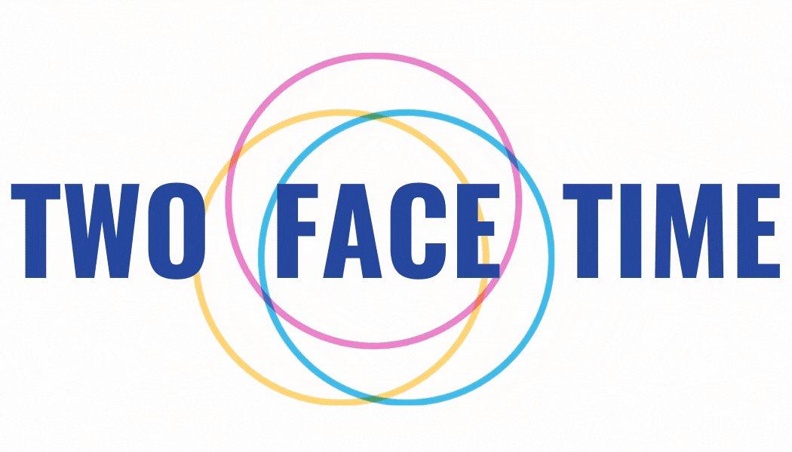

## 😃 Introduction

#### Two Face Time은 화상수업 및 회의에서 얼굴이 그대로 노출되는 것이 부담스럽고 어려운 이들을 위한 '이모티콘' 부착 웹 애플리케이션 입니다.

---

## 🔍 Contents

- Introduction
- Features
- Tech
- Motivation
- Duration and Process
- Challenges
- Things to do
- Links
- 프로젝트를 마치며
- Who participated

---

## 📱 Features

|                     Feature                     | Image |
| :---------------------------------------------: | :---: |
|         Google Login을 통해 서비스 이용         |       |
|          Group별로 초대 메일 발송 기능          |       |
|                Public Chat 기능                 |       |
|               Question Chat 기능                |       |
|                ScreenShare 기능                 |       |
| 화면의 '얼굴'을 인식해 이모티콘이 띄워지는 기능 |       |

---

## 💻 Tech

<ul>
Frontend 
<ul>
<li>React for component-based-architecture</li>
<li>Redux for state management</li>
<li>Styled Component</li>
<li>Firebase for social login</li>
<li>AWS S3 for save image file</li>
<li>Socket.io</li>
<li>Web RTC for real time communication</li>
<li>Jest for unit-test</li>
<li>Enzyme for component-test</li>
</ul>
Backend
<ul>
<li>Node.js</li>
<li>Express</li>
<li>MongoDB / MongoDB Atlas for data persistence</li>
<li>Moongoose</li>
<li>Node mailer </li>
<li>Chai / Mocha / SuperTest for unit-test</li>
</ul>
Task Tools
<ul>
<li>Git</li>
<li>Github for repositories</li>
<li>Trello for tasks management</li>
<li>LucidChart for Database Schema</li>
<li>Moqups for mockups </li>
</ul>
</ul>

---

## 🌸 Motivation

#### &nbsp; COVID-19 이후, 우리 사회는 화상수업 및 회의를 통해 '비대면'하는 사회로 급변하고 있습니다. 교육 현장을 포함한 모든 곳에서 COVID-19 확산 방지를 위해 변화에 적응해 가고 있는 중이지만, 우리에게 이러한 변화는 낯설고 어려운 게 사실입니다.

#### Two Face Time은 얼굴이 그대로 노출되는 화상수업과 회의가 부담스러웠던 저희의 경험을 토대로 '얼굴에 이모티콘을 부착해보자'는 아이디어에서 출발한 프로젝트입니다.

#### 아직은 '비대면' 화상수업 및 회의가 낯설고 어렵지만 COVID-19 속에서도 우리 사회는 멈추지 않아야 하기에, Two Face Time을 만들게 되었습니다.

---

## 📆 Duration and Process

- Duration

  - 2020.11.9 ~ 2020.11.28 (3 weeks ; 1 week idea + 2 weeks development)

- Process
  - [1주차] Idea 논의 및 기술 stack 검토, Mockup 작성, DB Schema 작성, Task 작성
  - [2주차] 로그인 구현, Main page, Room 페이지, Group 페이지, Node Mailer를 이용해 Group Member에게 초대 메일 보내는 기능, MailWeb RTC 연결
  - [3주차] socket.io, PeerJS, 채팅방 구현

---

## 🌋 Challenges

#### &nbsp;

### &nbsp; 1. state 관리를 위한 Redux의 늦은 도입

#### &nbsp; 프로젝트 기획 단계에서 이번 프로젝트는 Redux를 이용해 상태 관리를 할 필요가 없다고 생각 하였습니다. 그런데 프로젝트가 진행 될수록 상위에서 하위 컴포넌트로 넘겨줘야 하는 props들이 생각보다 너무 많아져, container의 필요성을 느끼게 되었습니다. 그렇게 프로젝트 10일차가 되던 11월 18일, Redux를 도입하게 되고 그동안 작성한 모든 코드들을 전면적으로 Refactoring 하게 되었습니다. 이미 Backend에 DB schema를 통해 일정한 형태로 데이터를 저장하고 주고 받고 있는 상황에서 Redux를 도입하다 보니 reducer 함수를 작성할 때 특히, 힘들었던 것 같습니다.

#### &nbsp;

#### &nbsp; 기획 단계에서 신중하게 생각하지 않는다면 프로젝트가 진행되는 중간에 예기치 못한 딜레이가 발생할 수 있다는 것을 몸소 느낀 경험이었습니다.

---

#### &nbsp;

### &nbsp; 2. 초대 메일을 타고 들어 온 user를 로그인 후, 해당 Room으로 Redirect 시키기

#### &nbsp; Group Member들을 Room으로 초대하기 위해 'Node Mailer'와 'uuid'를 이용하여 고유한 Room URL을 생성하여 초대 메일을 보냈습니다. 그런데 ‘로그인' 단계에서 초대 링크를 받고 들어 온 user인지 일반 user인지 판별하기가 어렵다는 문제를 마주하게 되었습니다. 이 부분이 판별 가능해야 초대 링크를 받고 들어 온 user는 로그인 성공 후, 해당 room으로 redirect 시킬 수 있기 때문입니다.

#### &nbsp;

#### &nbsp; 이 문제를 해결하기 위해서 처음 시도했던 방법은 document.referrer나 history를 이용해 ‘이전 URL’을 찾는 것이었습니다. 만약 ‘이전 URL’이 '메일함'인지 알 수 있다면 이 user를 초대 링크를 타고 온 user라고 판단할 수 있다고 생각했습니다. 하지만 초대 링크가 눌려지면 새로운 창이 열리면서 들어오기 때문에 history 추적이 되지 않다는 것을 알게 되었고 다른 방법을 찾아야 했습니다.

#### &nbsp;

#### &nbsp; 초대 링크를 받고 들어 온 user와 일반 user를 판별할 수 있는 방법이 ‘이전 URL’ 뿐일까를 고민하다가 ‘어떤 URL을 입력하여서 진입하였는지를 확인해보면 되겠다'는 생각에 이르렀습니다. 먼저, ‘react-router-dom’의 ‘useRouteMatch’ hook을 활용해 서비스에 진입하는 모든 user들이 어떠한 URL로 진입하였는지를 체크해 보았습니다. 가정대로 초대 링크를 받고 들어 온 user와 일반 user를 구분지을 수 있었습니다. 이렇게 validation 과정을 만들고 만약 고유한 Room link로 진입한 user가 있다면 그 Room Link는 로그인 성공 후, redirect 시켜주기 위해서 localStorage에 저장시켰습니다. 로그인에 성공했을 경우, localStorage에 저장된 라우트로 history.push 시켜 초대 링크를 받아 들어온 user를 로그인 후 해당 room으로 redirect 시킬 수 있게 되었습니다.

---

#### &nbsp;

### &nbsp; 3. https와 ssl 인증서 적용의 어려움

#### &nbsp; 화면에 영상을 띄우기 위해서 WebRTC(Web Real-Time Communication) API를 사용해야 했습니다. 카메라와 마이크를 navigator.mediaDevices 의 getUserMeida 메소드를 사용해서 MediaStream을 가져온 다음에 비디오를 화면에 띄울 수 있었습니다. 하지만 크롬이 업데이트 되면서 mediaDevices.getUserMedia 를 http 브라우저에선 사용할 수 없다는 것을 알게 되었습니다. 그래서 Frontend에서는 노드에서 스크립드를 시행할 때 HTTPS=true라는 옵션을 주어서 https로 만들었습니다. 그렇게 만들고나니 http인 서버 사이드와 https인 클라이언트와 사이에서 요청을 처리하는 데 문제가 발생했습니다. 그래서 Backend도 https 로 만들어야했는데, 안전한 서버라는 것을 인증하기 위해서 openSSL을 사용했습니다.

#### &nbsp; 이렇게 openSSL을 통해 공개키와 비공개키를 생성하고, Backend에 해당 키 파일을 넣어주어 https 서버 환경을 구축할 수 있었습니다.

---

## 📂 Things to do

<ul>
<li><input type='checkbox'> Frontend Test</input></li>
<li><input type='checkbox'> Backend Test</input></li>
<li><input type='checkbox'> Cypress를 이용한 E2E Test</input></li>
</ul>

---

## 🌈 Links

- [Frontend Repo in Github](https://github.com/Suri-Suri-Woori-Suri/TwoFaceTime-Frontend)

- [Backend Repo in Github](https://github.com/Suri-Suri-Woori-Suri/TwoFaceTime-Backend)

- [Mockup in Moqups](https://app.moqups.com/SEO7ODTGMx/view/page/a13f1c27d?fit_width=1)

- [Tasks in Trello](https://trello.com/b/ZHl4yPos/tasks)

- [DB Schema in LucidChard](https://lucid.app/lucidchart/invitations/accept/0bc1305f-98bf-4f87-9020-dd7d6afb4bc2)

---

## 🦋 프로젝트를 마치며...

####

---

## 👩🏻 🧒🏻 &nbsp; Who participated

### Team Name

<ul> 수리수리 우리 수리</ul>

### Team Members

<ul>
황수정 
<ul>
<li>email : crystal.hwang007@gmail.com</li>
</ul>
한우리
<ul>
<li>email : wrh95222@gmail.com </li>
</ul>
</ul>
